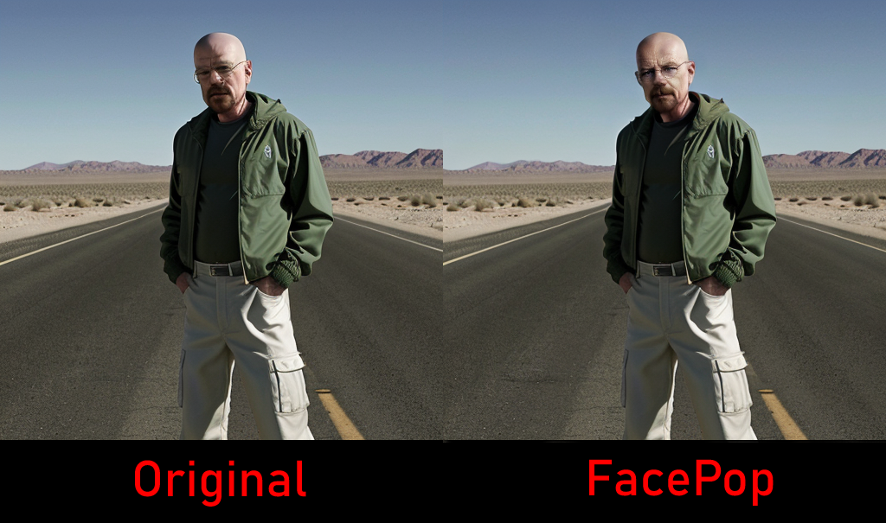
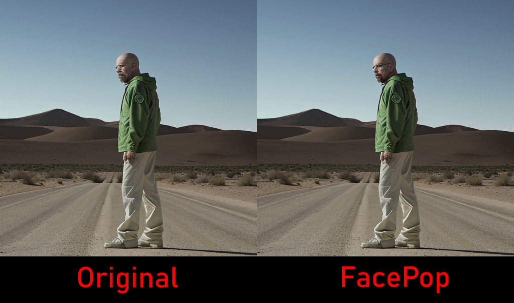
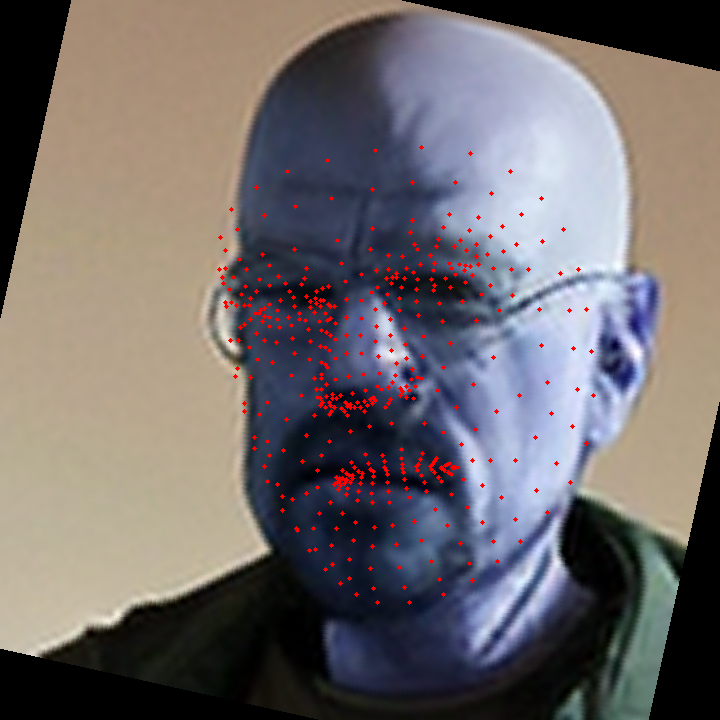
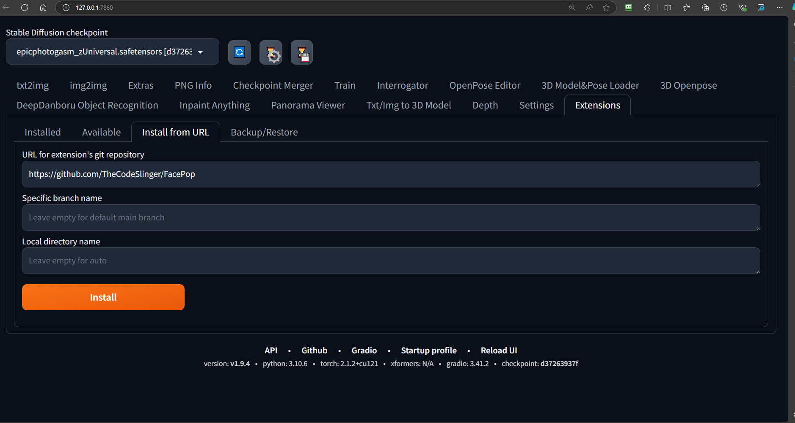
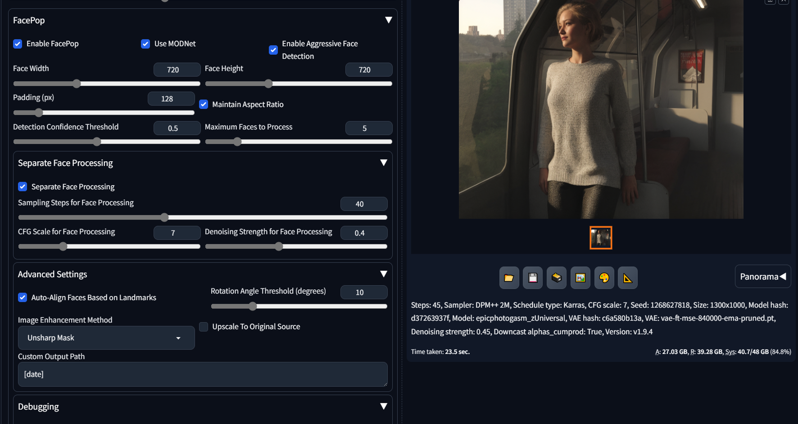
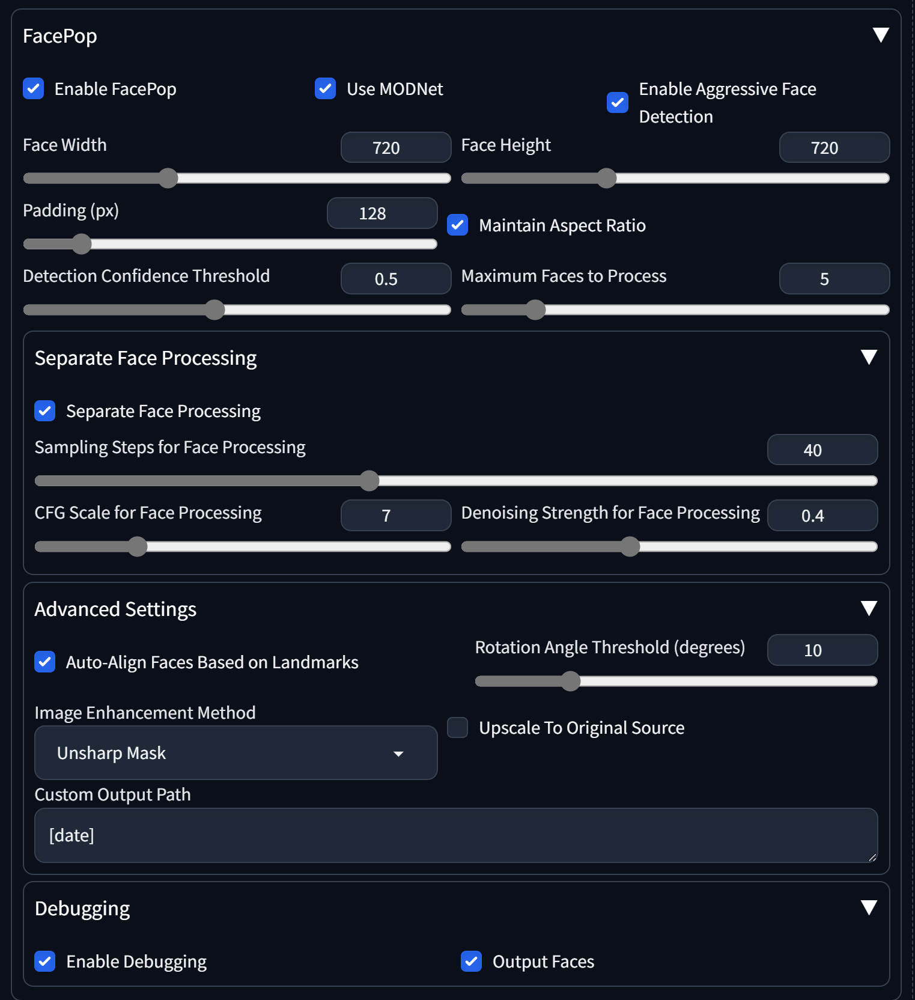

# FacePop


*<!-- Note: Add a logo image here, e.g., `images/logo.png` -->*

*<!-- Note: Add a logo image here, e.g., `images/logo.png` -->*

## Cropping Upscaling and BG Removal

An example of the low resolution image cropped, background removed, angle set for best generative img2img processing and first processing pass.

## Face Alignment for Processing

The red dots indicate the original position of the landmark detection. The image behind it is the face tilted to the most ideal upright angle for generative img2img processing.

## Final Process Masking

For final image composite a robust mask inpainting mask is applied so it doesn't receive a second generative process, but the rest of the image does. This allows for very good results of generative blending with the rest of the image.

## Introduction
**FacePop** is a robust extension for [AUTOMATIC1111's Stable Diffusion Web UI](https://github.com/AUTOMATIC1111/stable-diffusion-webui) that enhances image processing by detecting, enhancing, and managing faces within images. Leveraging advanced technologies like [Mediapipe](https://mediapipe.dev/), [MODNet](https://github.com/ZHKKKe/MODNet), and [ControlNet](https://github.com/lllyasviel/ControlNet), FacePop streamlines tasks such as face detection, background removal, and image enhancement directly within your Stable Diffusion workflow.

## Motivation

FacePop was developed as a solution to the limitations encountered with existing tools like **Zoom Enhancer**, eliminating the need for additional extensions such as **Unprompted**. While **Zoom Enhancer** provides basic facial zoom capabilities, FacePop offers more control and flexibility over facial detection and processing features. This extension not only enhances the zoom functionality but also integrates seamlessly with other popular plugins like **ControlNet**, **ReActor**, and **After Detailer**.

By leveraging these integrations, FacePop allows users to customize their image processing workflows extensively, ensuring that each facial enhancement task can be fine-tuned to meet specific requirements. Whether it's for facial feature refinement, background removal, or advanced image manipulation techniques, FacePop provides the necessary tools to achieve better results. This approach ensures that users have greater control over their image enhancements, making FacePop a valuable tool for anyone looking to improve their Stable Diffusion experience.

## What it Does

**FacePop** simplifies facial image processing within the Stable Diffusion workflow by offering a straightforward and customizable solution. Here's how FacePop works:

1. **Face Detection**:
    - **Spotting Faces**: Uses [Mediapipe](https://mediapipe.dev/) to accurately find and locate all the faces in your image.
    - **Finding Landmarks**: Identifies key points on each face to ensure they're properly aligned for the next steps.

2. **Face Cropping and Upscaling**:
    - **Cutting Out Faces**: Each detected face is neatly cropped from the main image based on your settings for width, height, and padding.
    - **Boosting Resolution**: The cropped faces are then upscaled to your chosen dimensions, making them clearer and more detailed.

3. **Rotating Faces Upright**:
    - **Aligning Faces**: Faces that are at odd angles or even upside down are rotated to an upright position. This ensures consistency and better quality during processing.
    - **Consistent Processing**: By standardizing the orientation, FacePop ensures that all faces, regardless of their original position, are enhanced uniformly.

4. **Separate Processing of Faces**:
    - **Focused Enhancements**: Each upright and upscaled face is processed individually. This allows for targeted improvements like color correction, sharpening, and background removal using [MODNet](https://github.com/ZHKKKe/MODNet).
    - **Independent Settings**: You can adjust sampling steps, CFG scaling, and denoising levels specifically for face processing, giving you more control over the final look.

5. **Mask Creation and Integration**:
    - **Making Masks**: After processing, FacePop creates masks around each enhanced face. This ensures that only the faces are affected during reintegration.
    - **Seamless Blending**: The masks help blend the enhanced faces back into the original image smoothly, avoiding any visible edges or mismatches.

6. **Final Image Composite and Processing**:
    - **Putting Faces Back**: The enhanced and properly oriented faces are placed back into their original spots in the main image using the masks.
    - **Final Touches**: The entire image is then processed again, which might include additional enhancements or integrations with other plugins like [ControlNet](https://github.com/lllyasviel/ControlNet), [ReActor](https://github.com/your-repo/ReActor), and [After Detailer](https://github.com/your-repo/After-Detailer). This step ensures everything looks polished and cohesive.

**Why FacePop?**

With **FacePop**, you get:

- **Better, More Consistent Faces**: Especially when using ControlNet's IPAdapter, FacePop ensures that all faces, regardless of their original orientation, are processed consistently for a uniform look.
- **Enhanced Control**: Adjust settings like sampling steps, CFG scaling, and denoising independently for faces, giving you the flexibility to tweak each face to perfection.
- **Smooth Integration**: Works seamlessly with other popular plugins, allowing you to incorporate FacePop into your existing workflow without any hassle.

By handling faces in a structured and efficient way, **FacePop** helps you achieve high-quality images with minimal effort. Whether you're tweaking a single portrait or handling multiple faces in a group shot, FacePop streamlines the process, making your image enhancements faster and more reliable.

## Table of Contents

- [Top](#facepop)
- [Motivation](#motivation)
- [What it Does](#what-it-does)
- [Features](#features)
- [Installation](#installation)
  - [Prerequisites](#prerequisites)
  - [Install via Extensions Manager](#install-via-extensions-manager)
- [Usage](#usage)
- [Deny Scripts File](#deny-scripts-list)
- [Screenshots](#screenshots)
- [Dependencies](#dependencies)
- [Contributing](#contributing)
- [License](#license)
- [Acknowledgements](#acknowledgements)

## Features

- **Face Detection**: Utilizes Mediapipe's Face Mesh and Face Detection for precise localization of faces.
- **Background Removal**: Integrates MODNet for effective background removal, focusing on portrait matting.
- **Image Enhancement**: Offers multiple enhancement methods including Unsharp Mask, Bilateral Filter, Median Filter, and a Hybrid approach.
- **Auto-Alignment**: Automatically aligns faces based on detected landmarks to ensure consistent processing.
- **Batch Processing**: Efficiently handles multiple faces with configurable batch settings.
- **ControlNet Integration**: Supports ControlNet for advanced image manipulation if installed.
- **Customizable Settings**: Provides a comprehensive UI with adjustable parameters for tailored processing.
- **Debugging Tools**: Includes debugging features to help troubleshoot and optimize processing steps.

## Installation

### Prerequisites

Before installing FacePop, ensure you have the following:

- [AUTOMATIC1111's Stable Diffusion Web UI](https://github.com/AUTOMATIC1111/stable-diffusion-webui) installed and set up.
- **Git** installed on your system to enable extension installation via URL.

### Install via Extensions Manager

1. **Open Stable Diffusion Web UI**:
   Launch your Stable Diffusion Web UI as you normally would.

2. **Navigate to Extensions**:
   Click on the `Extensions` tab in the sidebar.

3. **Install from URL**:
   - Click on the `Install from URL` button.
   - Enter the repository URL: `https://github.com/TheCodeSlinger/FacePop.git`
   - Click `Install`.

   
   *<!-- Note: Add an image showing the "Install from URL" button and where to input the URL -->*

4. **Restart Web UI**:
   After installation, you may be prompted to restart the Web UI. Follow the prompt to apply changes.

5. **Verify Installation**:
   - Once restarted, navigate to the `Extensions` tab to ensure `FacePop` is listed.
   - Alternatively, check within the Img2Img interface for the `FacePop` panel.

## Usage

1. **Open Img2Img Interface**:
   Navigate to the `Img2Img` tab within the Stable Diffusion Web UI.

2. **Locate FacePop Panel**:
   Scroll down to find the `FacePop` accordion or panel.

3. **Configure Settings**:
   - **Enable FacePop**: Toggle the extension on.
   - **Use MODNet**: Enable background removal.
   - **Enable Aggressive Face Detection**: Enhance face detection capabilities.
   - **Adjust Parameters**: Set face width, height, padding, detection confidence, maximum faces, and more as per your requirements.

   
   *<!-- Note: Add an image showing the FacePop settings within the Img2Img interface -->*

4. **Process Image**:
   - Upload or generate an image with faces.
   - Configure the desired settings in the FacePop panel.
   - Click `Generate` to process the image with FacePop enhancements.

5. **Review Results**:
   - Processed images will display enhanced faces.
   - Check the output directory for individual processed face images and the final composite image.

## Deny Scripts List

`deny_scripts_list.txt` is a crucial configuration file in the FacePop extension that allows users to specify which scripts should be ignored during specific processing stages. This ensures seamless integration and prevents potential conflicts between FacePop and other extensions or scripts within the Stable Diffusion Web UI.

### Purpose

The primary purpose of the `deny_scripts_list.txt` file is to **control the activation of certain scripts** during different phases of the image processing workflow. By specifying scripts to be ignored, FacePop can operate without interference, ensuring optimal performance and stability.

### File Structure

The `deny_scripts_list.txt` file is organized into sections, each corresponding to a different processing stage. Within each section, you can list the names of scripts that should be disabled during that particular stage.

```ini
; ignore any of these scripts when faces are being processed
[faces]
ADetailer

; ignore any of these scripts during final image composite
[final]
ReActor
```

**NOTE:** The main reason ReActor is excluded from final process is it seems to ingore inpaint masks, which the final composite image requires to prevent double processing of the face.

**NOTE:** ADetailer, we want to work but only on the final compsite image, not the upscaled cropped face. Some features in Adetailer work on other things like fingers and full body that may not be visible in just the face upscale. It hasn't been fully tested yet, and the final mask may prevent it from working as intended and I may need to come back to a solution for that if issues are submitted requesting this.

## Screenshots


*Figure 1: FacePop panel within the Img2Img interface.*


*Figure 2: Comparison of an image before and after FacePop processing.*

*<!-- Note: Replace the above image paths with actual image file paths once added to the repository -->*

## Dependencies

FacePop relies on several third-party libraries and tools to function effectively:

- [Mediapipe](https://mediapipe.dev/): For face detection and landmark recognition.
- [MODNet](https://github.com/ZHKKKe/MODNet): For background removal and matting.
- [ControlNet](https://github.com/lllyasviel/ControlNet): (Optional) For advanced image manipulation.
- [PyTorch](https://pytorch.org/): Required for MODNet and ControlNet.
- [OpenCV](https://opencv.org/): For image processing tasks.
- [Gradio](https://gradio.app/): For building the UI components.
- [Torchvision](https://pytorch.org/vision/stable/index.html): For image transformations.

These dependencies are automatically handled during installation via the Extensions Manager. If you encounter issues, you can manually install them using `pip`:

```bash
pip install mediapipe modnet torch torchvision opencv-python gradio
```
## **Additional Resources**

### **Model Files**

FacePop utilizes pre-trained models for efficient and accurate face detection. Below are the details of the essential model files used, including their descriptions and licensing information.

#### **1. deploy.prototxt**

- **Description**:
  
  The `deploy.prototxt` file defines the architecture of the Single Shot Multibox Detector (SSD) model used for face detection. It specifies the layers, parameters, and configurations required to deploy the model using OpenCV's Deep Neural Network (DNN) module.

- **Download Link**:
  
  You can download the `deploy.prototxt` file directly from the [FacePop repository](https://github.com/TheCodeSlinger/FacePop/blob/main/scripts/deploy.prototxt).

- **License**:
  
  The `deploy.prototxt` file is part of the OpenCV project and is licensed under the [Apache-2.0 License](https://opensource.org/licenses/Apache-2.0).

#### **2. res10_300x300_ssd_iter_140000.caffemodel**

- **Description**:
  
  The `res10_300x300_ssd_iter_140000.caffemodel` is the pre-trained weights file for the SSD (Single Shot Multibox Detector) model with a ResNet-10 backbone. This model is optimized for face detection and is widely used in conjunction with the `deploy.prototxt` configuration file to perform real-time face detection tasks.

- **Download Link**:
  
  You can download the `res10_300x300_ssd_iter_140000.caffemodel` file directly from the [FacePop repository](https://github.com/TheCodeSlinger/FacePop/blob/main/scripts/res10_300x300_ssd_iter_140000.caffemodel).

- **License**:
  
  Similar to the `deploy.prototxt`, the `res10_300x300_ssd_iter_140000.caffemodel` is part of the OpenCV project and is licensed under the [Apache-2.0 License](https://opensource.org/licenses/Apache-2.0).


#### **3. MODNet**

- **Description**:
  
  [MODNet](https://github.com/ZHKKKe/MODNet) is used for background removal and matting. It provides high-quality portrait matting by accurately separating the foreground (person) from the background.

- **Download Link**:
  
  You can download the MODNet model files directly from the [FacePop repository](https://github.com/TheCodeSlinger/FacePop/blob/main/scripts/modnet.pth).

- **License**:

  MODNet is licensed under the [Apache-2.0 License](https://opensource.org/licenses/Apache-2.0).

#### **4. How to Obtain and Integrate the Model Files**

1. **Download the Files**:
   
   - **deploy.prototxt**: [Download Here](https://github.com/TheCodeSlinger/FacePop/blob/main/scripts/deploy.prototxt)
   - **res10_300x300_ssd_iter_140000.caffemodel**: [Download Here](https://github.com/TheCodeSlinger/FacePop/blob/main/scripts/res10_300x300_ssd_iter_140000.caffemodel)
   - **MODNet**: [Download Here](https://github.com/TheCodeSlinger/FacePop/blob/main/scripts/modnet.pth)

2. **Place the Files in `\stable-diffusion-webui\extensions\FacePop\scripts\`**:

---

## **License**

FacePop is licensed under the [MIT License](LICENSE). See the [LICENSE](LICENSE) file for more details.

```text
MIT License

Copyright (c) 2024 TheCodeSlinger

Permission is hereby granted, free of charge, to any person obtaining a copy
...

